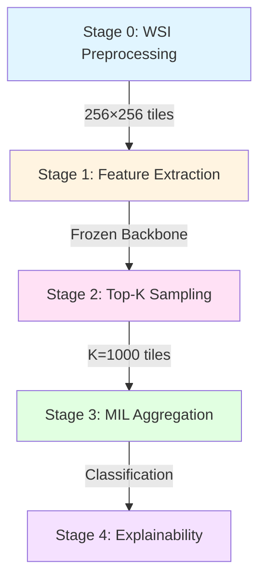

# 🎯 GigaPath AI WSI Breast Cancer Lesion Analysis

**Deep Learning Pipeline for Whole Slide Image Classification with Top-K Sampling**

[](https://www.python.org/)
[](https://pytorch.org/)
[](LICENSE)

---

## 📋 Overview

This project implements a state-of-the-art **Multiple Instance Learning (MIL)** pipeline for automated breast cancer classification from Whole Slide Images (WSI). The system leverages **Top-K tile sampling** to reduce computational overhead while maintaining high accuracy, making it suitable for resource-constrained environments (RTX 4070 8GB GPU).

### 🎓 Academic Context

This implementation follows modern WSI analysis methodologies (CLAM-style pipelines) and incorporates best practices from digital pathology research. The architecture is designed for:
- **Reproducible experiments** with deterministic behavior
- **Efficient GPU utilization** with smart memory management
- **Explainable AI** through attention-based heatmaps
- **Academic rigor** suitable for research papers and thesis work

---

## 🏗️ Architecture

The pipeline consists of **5 distinct stages**:



### Stage Breakdown

| Stage | Description | Key Technology | Output |
|-------|-------------|----------------|--------|
| **0: Preprocessing** | Tissue detection & tiling | OpenSlide, OpenCV | 256×256 tiles + coordinates |
| **1: Feature Extraction** | Frozen SSL backbone | ResNet50/CTransPath | 2048-dim embeddings (cached) |
| **2: Top-K Sampling** | Attention-based ranking | Feature norm / Attention | K=1000 most informative tiles |
| **3: MIL Aggregation** | Slide-level classification | Attention MIL / Gated MIL | Benign/Malignant prediction |
| **4: Explainability** | Attention heatmaps | Attention weights | WSI overlay visualization |

---

## 🎯 Key Features

### ✅ Top-K Tile Sampling
- **Problem**: WSI contains 10k–100k tiles, most are background/uninformative
- **Solution**: Rank tiles by attention scores, select top K=1000
- **Benefit**: 10× faster training, sharper heatmaps, stable MIL learning

### ✅ GPU-Safe Design
- Optimized for **RTX 4070 8GB** with VRAM monitoring
- Automatic batch size adjustment
- Mixed precision training (AMP)
- Feature caching to avoid recomputation

### ✅ Full Reproducibility
```yaml
experiment:
  seed: 42
  deterministic: true
```
- Fixed random seeds across NumPy, PyTorch, Python
- Deterministic algorithms enabled
- Same results across multiple runs

### ✅ Explainability
- Attention-based heatmaps showing critical regions
- Tile-level importance scores
- WSI overlay visualization

---

## 🚀 Quick Start

### 1. Installation

```bash
# Clone repository
git clone https://github.com/yourusername/GigaPath-AI-WSI-Breast-Cancer-Lesion-Analysis.git
cd GigaPath-AI-WSI-Breast-Cancer-Lesion-Analysis

# Create virtual environment
python -m venv venv
source venv/bin/activate  # On Windows: venv\Scripts\activate

# Install dependencies
pip install -r requirements.txt

# Install package
pip install -e .
```

### 2. Verify Installation

```bash
# Check Python version
python --version  # Should be 3.8+

# Check PyTorch GPU support
python -c "import torch; print(f'CUDA Available: {torch.cuda.is_available()}')"
python -c "import torch; print(f'GPU: {torch.cuda.get_device_name(0)}')"

# Check OpenSlide
python -c "import openslide; print(f'OpenSlide OK')"
```

### 3. Configuration

Edit `configs/config.yaml` to set:
- Data paths (`paths.raw_wsi`)
- GPU settings (`hardware.gpu_id`)
- Model parameters (`mil.architecture`)
- Top-K value (`sampling.k`)

### 4. Run Pipeline

```bash
# Stage 0: Preprocess WSI
python scripts/preprocess.py --config configs/config.yaml

# Stage 1: Extract features
python scripts/extract_features.py --config configs/config.yaml

# Stage 2: Sample top-K tiles
python scripts/sample_tiles.py --config configs/config.yaml

# Stage 3: Train MIL classifier
python scripts/train_mil.py --config configs/config.yaml

# Stage 4: Generate heatmaps
python scripts/generate_heatmaps.py --config configs/config.yaml
```

---

## 📁 Project Structure

```
GigaPath-AI-WSI-Breast-Cancer-Lesion-Analysis/
├── src/
│   ├── preprocessing/          # Stage 0: Tissue detection & tiling
│   ├── feature_extraction/     # Stage 1: Frozen backbone features
│   ├── sampling/               # Stage 2: Top-K tile selection
│   ├── mil/                    # Stage 3: MIL models
│   ├── explainability/         # Stage 4: Heatmap generation
│   └── utils/                  # Shared utilities
│       ├── logger.py           # Logging system
│       ├── seed.py             # Reproducibility
│       ├── gpu_monitor.py      # VRAM tracking
│       └── config.py           # Config loading
├── configs/
│   └── config.yaml             # Pipeline configuration
├── scripts/                    # CLI entry points
├── tests/                      # Unit & integration tests
├── data/                       # Data directory (gitignored)
├── notebooks/                  # Jupyter notebooks
├── requirements.txt
├── setup.py
└── README.md
```

---

## 💻 Hardware Requirements

### Minimum
- **GPU**: NVIDIA RTX 4070 8GB (or equivalent)
- **RAM**: 16 GB
- **Storage**: 100 GB (for WSI data + features)
- **OS**: Windows 10/11, Linux (Ubuntu 20.04+)

### Recommended
- **GPU**: RTX 4080 16GB or higher
- **RAM**: 32 GB
- **Storage**: 500 GB SSD

---

## 🧠 Academic Usage

### For Reports/Papers

You can describe this system as:

> *"We implement a Top-K tile sampling strategy prior to MIL aggregation, retaining only the K=1000 most informative tiles ranked by attention scores. This reduces computational overhead by ~10× while suppressing irrelevant background regions, enabling stable MIL training and sharper explainability heatmaps."*

### Key Citations

This architecture is inspired by:
- **CLAM** (Lu et al., 2021): Data-efficient and weakly supervised computational pathology
- **Attention MIL** (Ilse et al., 2018): Deep multiple instance learning
- **Top-K Sampling**: Modern WSI analysis best practices

---

## 📊 Expected Results

| Metric | Value |
|--------|-------|
| **Preprocessing** | ~500-1000 tiles/WSI (after filtering) |
| **Feature Extraction** | ~10-15 slides/hour (RTX 4070) |
| **Top-K Selection** | K=1000 tiles retained |
| **Training Time** | ~2-3 hours/epoch (dataset-dependent) |
| **VRAM Usage** | <7.5 GB (safe margin) |
| **Reproducibility** | 100% (deterministic mode) |

---

## 🛠️ Development

### Run Tests

```bash
pytest tests/
```

### Code Style

```bash
# Format code
black src/

# Lint code
flake8 src/
```

---

## 📝 License

MIT License - see [LICENSE](LICENSE) file for details.

---

## 👥 Contributing

Contributions are welcome! Please:
1. Fork the repository
2. Create a feature branch
3. Submit a pull request

---

## 📧 Contact

For questions or collaboration:
- **Author**: Aaradhy Patil
- **Email**: 
- **GitHub**: [@yourusername](https://github.com/yourusername)

---

## 🙏 Acknowledgments

- OpenSlide library for WSI handling
- PyTorch team for deep learning framework
- Digital pathology research community

---

**Built with ❤️ for advancing AI in digital pathology**
